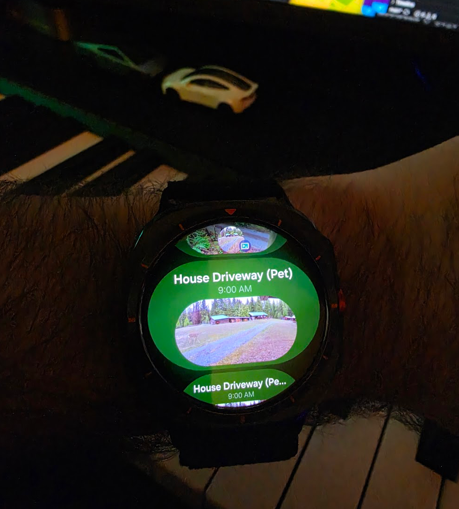

# Dolly


In a dangerous world, where in 2026 I have to stare at a event with no image on my watch, I decided to do something about it.



Python daemon that monitors Blink, Wyze, and Tuya-based cameras (ieGeek, Ctronics, etc.) for motion events and pushes rich image notifications to Android via [ntfy](https://ntfy.sh) — optimized for Samsung Galaxy Watch Ultra (BigPictureStyle).

## Setup

```bash
python3 -m venv .venv
source .venv/bin/activate
pip install -r requirements.txt
cp config.yaml.example config.yaml
```

Edit `config.yaml` with your camera credentials and ntfy topic.

### Blink

On first run you'll be prompted for a 2FA code sent to your email/phone. Credentials are cached in `blink.json` for subsequent runs.

### Tuya (ieGeek, Ctronics, and other white-label brands)

Many budget camera brands are white-label Tuya devices. If your camera's app connects to Smart Life or uses a Tuya-based cloud, this is the integration for you.

1. Create a free account at the [Tuya IoT Platform](https://iot.tuya.com)
2. Create a **Cloud Project**:
   - Go to Cloud > Development > Create Cloud Project
   - Select your data center (Western America for US, Central Europe for EU)
   - Under **Service API**, subscribe to: **IoT Core**, **Smart Home Device Management**, and **Device Log Query**
3. Get your **Access ID** and **Access Secret** from the project overview page
4. Link your camera app account:
   - In the Cloud Project, go to **Devices** > **Link Tuya App Account**
   - Open the Smart Life app (or your brand's app) > Profile > scan the QR code shown on the Tuya IoT page
   - Your devices should now appear under the Devices tab
5. Choose your region in `config.yaml`:
   - `us` — `openapi.tuyaus.com` (Americas)
   - `eu` — `openapi.tuyaeu.com` (Europe)
   - `cn` — `openapi.tuyacn.com` (China)
   - `in` — `openapi.tuyain.com` (India)
6. Add your credentials to `config.yaml`:
   ```yaml
   - source: tuya
     access_id: "your-access-id"
     access_secret: "your-access-secret"
     region: "us"
   ```
7. (Optional) To monitor specific cameras only, add `device_ids` — find IDs on the Tuya IoT Devices page:
   ```yaml
     device_ids:
       - "bf63..."
       - "eb04..."
   ```

### Wyze

Wyze requires an API key pair and email/password authentication.

1. Get your API key and key ID from the [Wyze Developer Console](https://developer-api-console.wyze.com)
2. If you sign in with Google or Apple, Wyze doesn't expose a password by default. To set one:
   - Go to Google Account > Security > Third-party connections
   - Unlink Wyze
   - In the Wyze app, tap "Sign in with email" and use "Forgot password" with your Google/Apple email
   - Set a password via the reset link
   - You can re-link Google/Apple afterward if you want
3. Add your email, password, key_id, and api_key to `config.yaml`

## Test Authentication

```bash
source .venv/bin/activate && python tests/auth.py
```

## Notifications (ntfy)

Dolly uses [ntfy](https://ntfy.sh) to push notifications to your phone/watch. It's free, open source, and requires no account.

1. Install the app: [Android (Play Store)](https://play.google.com/store/apps/details?id=io.heckel.ntfy) · [iOS (App Store)](https://apps.apple.com/us/app/ntfy/id1625396347)
2. Subscribe to a topic — **pick something unique and hard to guess**. ntfy topics are public by default, so anyone who knows the name can read your alerts. Use something like `dolly-cam-a7f3x9` not `dolly-cams`.
3. Set the same topic in `config.yaml` under `ntfy.topic`

If you'd rather self-host or want private topics, ntfy supports [self-hosting](https://docs.ntfy.sh/install/) and [access control](https://docs.ntfy.sh/config/#access-control). Alternatives to ntfy include [Pushover](https://pushover.net) (paid, private by default) and [Gotify](https://gotify.net) (self-hosted) — those would require swapping out `dolly/notifier.py`.

## Test Notifications

Send a test notification to verify your setup:

```bash
source .venv/bin/activate && python tests/notify.py
```

## Run the Daemon

```bash
source .venv/bin/activate && python run.py
```

Polls cameras every 10s, detects new motion clips, extracts a frame from the clip, and pushes it to ntfy. Ctrl-C to stop.

## Install as macOS Service

Runs as a launchd agent — auto-starts on login, restarts on crash.

```bash
make install   # symlinks the plist into ~/Library/LaunchAgents/
make start     # load the daemon
```

Manage:

```bash
make start     # start the daemon
make stop      # stop the daemon
make restart   # stop + start
make status    # check if running
make tail      # follow the log
make logs      # dump the full log
make uninstall # stop and remove the plist
```

Logs: `dolly.log` in the project directory.

**Note:** Run `python run.py` manually first to complete Blink 2FA. The cached token in `blink.json` is used for headless operation. If the token expires, check `dolly.log` — you'll need to run manually again to re-authenticate.

## Project Structure

```
├── run.py                     # Daemon entry point
├── tests/
│   ├── auth.py                # Camera authentication
│   ├── motion.py              # One-shot motion check
│   ├── notify.py              # Send a notification
│   └── debug_media.py         # Debug Blink media API
└── dolly/
    ├── config.py              # YAML loader + camera source factory
    ├── daemon.py              # Poll loop + motion state tracking
    ├── notifier.py            # ntfy push (image + text)
    └── cameras/
        ├── base.py            # CameraSource ABC + CameraInfo dataclass
        ├── blink.py           # Blink integration (blinkpy)
        ├── tuya.py            # Tuya integration (ieGeek, Ctronics, etc.)
        └── wyze.py            # Wyze integration (wyze-sdk)
```

### Adding a new camera brand

1. Create `dolly/cameras/newbrand.py` implementing `CameraSource`
2. Register it in `dolly/config.py:build_sources()`
3. Add config block to `config.yaml`
